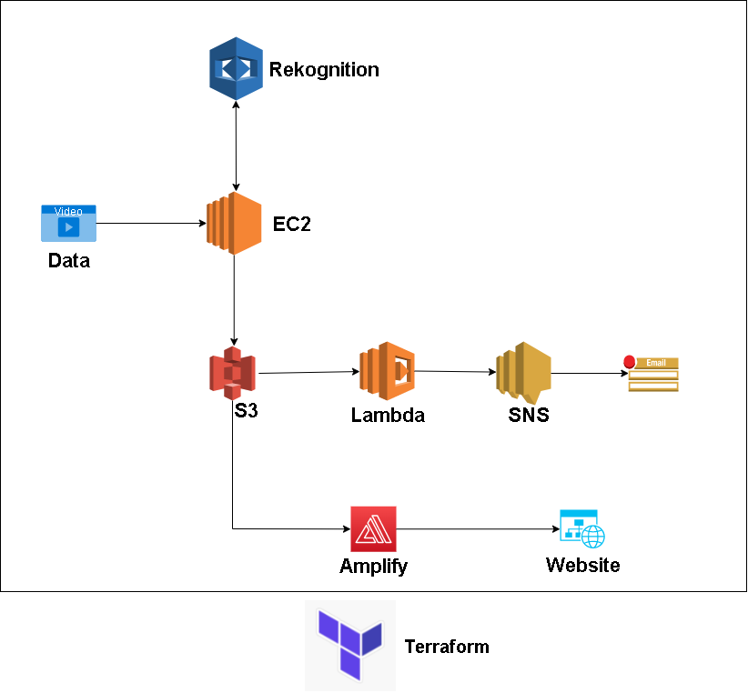
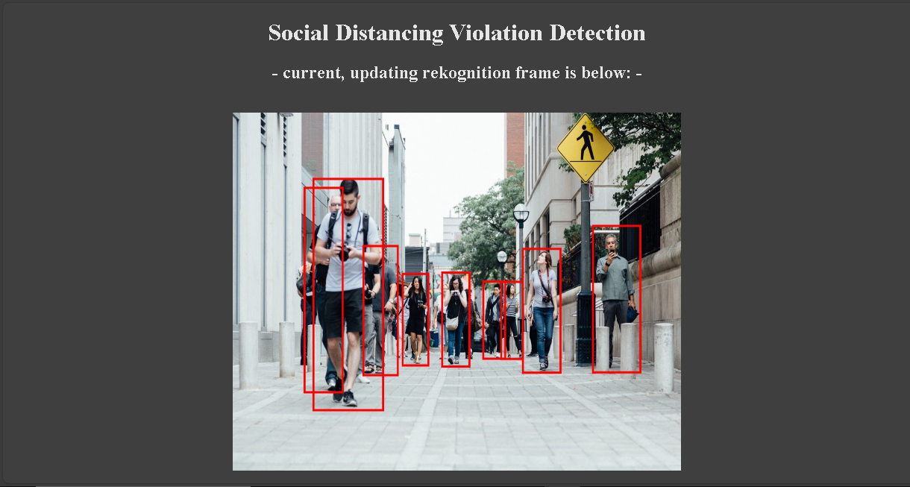

  

<h1 align="center">Social Distancing Violation Detection App</h1>

     <h4 align="center">This project is designed to alert authorities about social distancing violations in crowded areas.
     </h4> 
      

-----------------------------------------
### Overview
Our project’s mission is to provide a service that can help with issues related to crowds, estimating crowd density, and the detection of social distancing violations. Our solution towards this goal provides a system for any input video feed, that allows administrators of events and/or locations to count the number of social distancing violations in a specified location. A video feed is sent into the system, which parses through frames of it and then analyzes them using machine learning to detect violations of people found within. The system keeps track of the number of violations at any particular time as they are in-frame of the feed, and updates every 10 frames. In the event that a predefined threshold number of social distancing violations is exceeded, the system will send a notification to appropriate administrators and the authorities. These messages contain timestamps as well as the associated analyzed video frame that triggered the violation. This service will help with the enforcing of social distancing rules in crowded areas.

-----------------------------------------

### Project Goals

* Create a system that will take in a video feed and analyze its frames for people, putting bounding boxes around them.
* Create a method the system will use to calculate whether an analyzed frame contains social distancing violations.
* Create a frontend for the system that will display the continuously analyzed and updated video frames.
* Create a part of the system that upon finding one or more violations will send appropriate notifications to preset administrators.
* For all previous goals of this project, use some form of Infrastructure as Code to automate the building, deployment, and teardown of the system.

-----------------------------------------

### Architecture
  

  

 
An EC2 instance runs a Rekognition script that analyzes video footage using the openCV library. The EC2 instance interacts with two S3 buckets: one that is used for a lambda to send email notifications regarding violations using SNS, while the other is used to provide a video feed for the Amplify front-end. The entire infrastructure is deployed using Terraform on a Free Tier AWS account with root access.

-----------------------------------------

### AWS Technologies Used

* `AWS Rekognition`: Our project utilizes a Python script in order to utilize AWS Rekognition for image analysis. AWS provides an SDK called boto3, which allows us to use AWS services from python. Our script allows for video input to be taken from both Youtube video links/feeds, sources from an S3 Bucket, and local machine. Once the video source has been set, we are  using OpenCV to process the video and divide it into frames. Every 10th frame is then processed by Rekognition and given bounding boxes that surround every person within the frame. The frame is then searched for violations based on a hardcoded pixel distance between bounding boxes.
* `AWS S3`: S3 is a simple storage service used for storing objects. In our project, two separate S3 buckets are used. The first is used for containing continuous footage of the Rekognition-processed frames, which will in turn be used by the project’s frontend to display an updating video feed of processed frames. S3 makes it simple to obtain image URLs in order to send them via email and display them on the front-end. The second S3 bucket is used for tracking any processed frames whose number of violations occurring at specific times exceeds a given threshold. S3 allows for a lambda trigger to be set to a bucket, which allows the second S3 bucket to trigger SNS messages to be sent to appropriate administrators, authorities, and users.
* `AWS Lambda`: Lambda is a serverless cloud-computing platform used to perform functions in response to events. The S3 bucket that tracked violations was used as a trigger for the lambda, which sent an email notification to the user using AWS SNS.
* `AWS SNS`: AWS SNS is a simple notification service. Our project creates an SNS topic and subscription for violation messages. When sent information via a lambda trigger in our second S3 bucket is sent to SNS, the timestamp information as well as the link of the violation frame is sent within an email to appropriate administrators, users, and authorities.
* `AWS Amplify`: This is a deployment and hosting service for web applications that allows us quick, simple, and maintainable hosting for our frontend.. For our project we created and pushed a static web application to a publicly accessible GitHub repository. Our project tells Amplify to extract the app from this repository and host it in a new Amplify app. When visited, the web app continuously refreshes its own central image every second. It does this by grabbing the newest image link from the first S3 bucket. Each frame sent to the first S3 bucket is stored as the same filename, so each time a new one is processed and stored, the old image is replaced. This gives surety that the Amplify frontend will always get the most updated image by refreshing and grabbing the same link every second. The Amplify web app finally displays the most recently processed video frame.

-----------------------------------------

### Why Cloud (AWS) 

The cloud allowed us to start up and tear down multiple technologies including an EC2 server without having to deal with concerns of hardware. This gave us the ability to focus solely on our project (the software). In addition, our project dealt with the analyzing of continuous video frames that theoretically could have no end. Because of this, any storage scaling and related functionalities were at our disposal to use. Finally, using the cloud allowed us to connect our different technologies together much easier using lambdas and direct image links, which may have been a more tedious process if we had used non-cloud resources.

-----------------------------------------

### Output

  

-----------------------------------------

### Contributors

Shivam Mahajan - [ShivamSpm](https://github.com/ShivamSpm)

Amey Shahane - [AmeyShahane](https://github.com/AmeyShahane)

Chirayu Marathe - [Cam-98](https://github.com/Cam-98)
